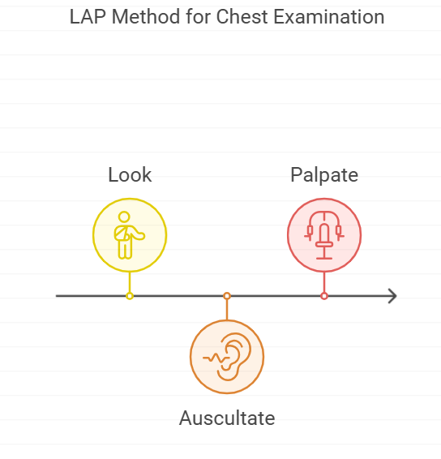
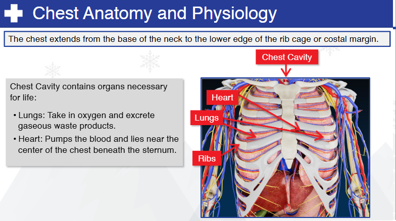
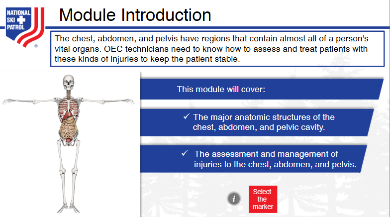
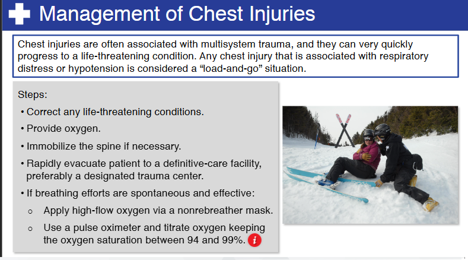
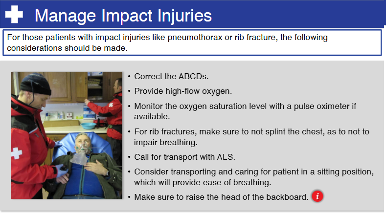

    
# Nsp Oec Training Chapter 23 

## National Ski Patrol - Outdoor Emergency Care chapter 23

    
Chapter 23: Chest Trauma

1. List the major anatomic structures of the chest cavity.
2. Define and list the signs and symptoms of various chest injuries.
3. Describe and demonstrate how to assess chest for trauma, including using the LAP method.
4. Describe the management of chest injuries.

## 23.1 List the major anatomic structures of the chest cavity.

The major anatomic structures of the chest cavity, also known as the **thoracic cavity**, include:

1. **Lungs**: The two large organs responsible for gas exchange (oxygen and carbon dioxide) during breathing.
   
2. **Heart**: The muscular organ located in the mediastinum that pumps blood throughout the body.

3. **Trachea**: The windpipe that serves as the main airway, conducting air to and from the lungs.

4. **Bronchi and Bronchioles**: The branching airways that lead from the trachea to the lungs; the bronchi divide into smaller bronchioles within the lungs.

5. **Esophagus**: The muscular tube that passes food and liquids from the throat to the stomach, located behind the trachea and heart.

6. **Diaphragm**: The dome-shaped muscle at the bottom of the chest cavity that separates it from the abdominal cavity; it plays a key role in breathing.

7. **Ribs and Intercostal Muscles**: The ribs form the bony structure of the chest wall, and the intercostal muscles between the ribs assist with breathing by expanding and contracting the chest.

8. **Pleura**:
   - **Visceral Pleura**: The membrane that covers the surface of the lungs.
   - **Parietal Pleura**: The membrane that lines the inside of the chest wall and diaphragm.
   - **Pleural Cavity**: The space between the visceral and parietal pleura, containing a small amount of lubricating fluid that allows smooth lung movement during respiration.

9. **Great Vessels**:
   - **Aorta**: The major artery that carries oxygenated blood from the heart to the body.
   - **Pulmonary Arteries and Veins**: The vessels that transport blood between the heart and lungs for oxygenation.
   - **Superior and Inferior Vena Cava**: Large veins that return deoxygenated blood from the body to the heart.

10. **Mediastinum**: The central compartment of the thoracic cavity, containing the heart, great vessels, trachea, esophagus, and lymph nodes.

These structures work together to facilitate respiration, circulation, and digestion, while being protected by the bony rib cage.

## 23.2 Define and list the signs and symptoms of various chest injuries.

Chest injuries can vary widely in severity, from minor bruises to life-threatening trauma. Here is a list of common chest injuries and their associated signs and symptoms:

### 1. **Rib Fracture**
   - **Definition**: A break or crack in one or more of the ribs, often caused by blunt trauma.
   - **Signs and Symptoms**:
     - Sharp pain at the site of the injury, especially when breathing, coughing, or moving
     - Shallow breathing due to pain
     - Bruising or swelling over the injured area
     - Crepitus (a crunching sound or feeling) if bones are rubbing together

### 2. **Flail Chest**
   - **Definition**: A condition where two or more adjacent ribs are fractured in multiple places, causing a segment of the chest wall to move independently.
   - **Signs and Symptoms**:
     - Paradoxical chest movement (the flail segment moves inward during inhalation and outward during exhalation, opposite to normal chest movement)
     - Severe pain in the chest
     - Difficulty breathing or shortness of breath
     - Bruising or swelling over the injured area
     - Cyanosis (bluish skin color) due to inadequate oxygenation

### 3. **Pneumothorax**
   - **Definition**: The presence of air in the pleural space (the area between the lungs and chest wall), causing the lung to collapse.
   - **Signs and Symptoms**:
     - Sudden, sharp chest pain
     - Difficulty breathing or shortness of breath
     - Decreased or absent breath sounds on the affected side
     - Rapid heart rate (tachycardia)
     - Cyanosis in severe cases
     - Hyperresonance (a hollow sound when the chest is tapped)

### 4. **Tension Pneumothorax**
   - **Definition**: A life-threatening condition where air continues to accumulate in the pleural space, causing pressure on the lungs, heart, and major blood vessels.
   - **Signs and Symptoms**:
     - Severe difficulty breathing
     - Tracheal deviation (shift of the trachea toward the unaffected side)
     - Distended neck veins (jugular venous distension)
     - Decreased or absent breath sounds on the affected side
     - Rapid heart rate and low blood pressure (shock)
     - Cyanosis
     - Anxiety or agitation due to hypoxia (lack of oxygen)

### 5. **Hemothorax**
   - **Definition**: The accumulation of blood in the pleural space, often caused by trauma or injury to the chest.
   - **Signs and Symptoms**:
     - Difficulty breathing
     - Chest pain
     - Signs of shock (rapid heart rate, pale skin, sweating, low blood pressure)
     - Decreased or absent breath sounds on the affected side
     - Dullness on percussion (when tapping the chest, a dull sound indicates fluid accumulation)

### 6. **Pulmonary Contusion**
   - **Definition**: Bruising of the lung tissue, usually caused by blunt trauma, leading to bleeding and swelling within the lung.
   - **Signs and Symptoms**:
     - Chest pain
     - Difficulty breathing or shortness of breath
     - Coughing up blood (hemoptysis)
     - Cyanosis
     - Decreased oxygen levels (hypoxia)
     - Rapid breathing (tachypnea)

### 7. **Cardiac Contusion**
   - **Definition**: Bruising of the heart muscle, often caused by blunt trauma to the chest.
   - **Signs and Symptoms**:
     - Chest pain (may mimic heart attack symptoms)
     - Irregular heart rhythms (arrhythmias)
     - Signs of heart failure (difficulty breathing, swelling in the legs)
     - Low blood pressure (hypotension)
     - Signs of shock

### 8. **Pericardial Tamponade (Cardiac Tamponade)**
   - **Definition**: The accumulation of blood or fluid in the pericardial sac (the membrane around the heart), leading to compression of the heart and impaired heart function.
   - **Signs and Symptoms**:
     - Difficulty breathing
     - Rapid heart rate
     - Low blood pressure (shock)
     - Distended neck veins (jugular venous distension)
     - Muffled heart sounds (due to fluid around the heart)
     - Cyanosis
     - Pulsus paradoxus (a significant drop in blood pressure during inhalation)

### 9. **Aortic Injury**
   - **Definition**: A tear or rupture of the aorta, typically caused by high-impact trauma (e.g., car accidents, falls from height). This is a life-threatening condition.
   - **Signs and Symptoms**:
     - Severe chest or back pain
     - Signs of shock (rapid heart rate, low blood pressure, pale or sweaty skin)
     - Difference in blood pressure between arms
     - Loss of consciousness in severe cases
     - Difficulty breathing

### 10. **Sucking Chest Wound (Open Pneumothorax)**
   - **Definition**: A penetrating injury to the chest that allows air to enter the pleural space, causing the lung to collapse.
   - **Signs and Symptoms**:
     - A visible wound on the chest
     - A sucking sound as air moves in and out of the wound
     - Difficulty breathing
     - Decreased or absent breath sounds on the affected side
     - Rapid heart rate
     - Cyanosis

### 11. **Traumatic Asphyxia**
   - **Definition**: A condition where severe chest compression (e.g., in a crush injury) causes blood to be forced out of the chest and into the veins of the head and neck.
   - **Signs and Symptoms**:
     - Distended neck veins
     - Cyanosis (bluish skin) of the face and upper body
     - Swelling or bruising around the face, neck, and shoulders
     - Red or purple discoloration of the skin (petechiae)
     - Cyanosis

## 23.3 Describe and demonstrate how to assess chest for trauma, including using the LAP method.

### Assessing the Chest for Trauma: The LAP Method

The **LAP method** is a simple approach used to assess the chest for trauma and injury. LAP stands for **Look**, **Auscultate**, and **Palpate**, and each step helps identify signs of potential injury.

#### 1. **Look**
   - **Visual Inspection**: Begin by visually inspecting the chest for any signs of injury.
     - **Bruising, swelling, or deformities**: Look for bruises (ecchymosis), swelling, or deformities, such as rib fractures or flail segments.
     - **Open wounds**: Check for any penetrating injuries, like stab wounds or gunshot wounds, or a **sucking chest wound**.
     - **Respiratory effort**: Observe the patient's breathing. Is it labored or shallow? Look for paradoxical movement (flail chest) where part of the chest moves opposite to the rest.
     - **Cyanosis**: Check for a bluish tinge to the skin, which may indicate poor oxygenation.

#### 2. **Auscultate**
   - **Listening with a Stethoscope**: Auscultate the chest to assess for breath sounds in different areas.
     - **Normal breath sounds**: Ensure that breath sounds are present and equal on both sides.
     - **Decreased or absent breath sounds**: This may indicate a **pneumothorax** (collapsed lung), **hemothorax** (blood in the pleural space), or lung contusion.
     - **Wheezing or crackles**: These sounds can suggest a pulmonary contusion or other internal injuries.

#### 3. **Palpate**
   - **Feeling the Chest**: Gently palpate the chest to detect abnormalities or areas of pain.
     - **Tenderness**: Palpate for areas of tenderness, which can indicate fractures or internal injury.
     - **Crepitus**: Feel for crepitus (a crunching sensation under the skin), which can be caused by fractured ribs or subcutaneous air (from a pneumothorax).
     - **Symmetry**: Check for equal rise and fall of both sides of the chest during breathing. Asymmetry could indicate trauma to one side of the chest or diaphragm.
     - **Subcutaneous emphysema**: Feel for air trapped under the skin, which feels like "crackling" under your fingers and can indicate pneumothorax.

---

### Brief Demonstration of Using the LAP Method

1. **Look**: 
   - Examine the chest for visible injuries, bruising, and signs of breathing difficulty.
   - Notice any irregularities like paradoxical movement or cyanosis.

2. **Auscultate**:
   - Place the stethoscope on both sides of the chest, starting at the upper lungs and moving down.
   - Compare sounds from left to right to detect decreased or absent breath sounds.

3. **Palpate**:
   - Gently press on the ribs and chest wall, feeling for tenderness, crepitus, or deformities.
   - Check if the chest moves symmetrically when the patient breathes.

### Conclusion:
By following the **LAP method** (Look, Auscultate, Palpate), you can effectively assess a patient's chest for trauma and identify life-threatening conditions, such as pneumothorax, rib fractures, and flail chest, requiring immediate medical attention.

## 23.4 Describe the management of chest injuries.

The management of chest injuries depends on the type and severity of the injury. Immediate care is aimed at stabilizing the patient, ensuring adequate breathing, and preventing further complications. Here is an overview of how to manage various types of chest injuries:

### General Principles for Chest Injury Management:

1. **Ensure Airway, Breathing, and Circulation (ABCs):**
   - **Airway**: Make sure the airway is clear and patent. Perform basic airway maneuvers (e.g., chin lift, jaw thrust) if needed.
   - **Breathing**: Assess the patient's breathing. Administer high-flow oxygen if the patient has any respiratory distress or difficulty breathing.
   - **Circulation**: Control any external bleeding and monitor for signs of shock (e.g., rapid pulse, low blood pressure).

2. **Provide Oxygen:**
   - Administer **high-flow oxygen** via a non-rebreather mask to improve oxygenation, especially in patients with respiratory distress, pneumothorax, or other lung injuries.

3. **Positioning:**
   - If no spinal injury is suspected, place the patient in a **semi-upright position** to aid breathing.
   - If spinal injury is suspected, maintain the patient in a **supine position** with spinal precautions (e.g., cervical collar).

4. **Monitor Vital Signs:**
   - Continuously monitor oxygen saturation, heart rate, respiratory rate, and blood pressure.
   - Check for signs of deterioration, such as increasing difficulty in breathing or signs of shock.

### Specific Management of Common Chest Injuries:

#### 1. **Rib Fractures:**
   - **Pain management**: Administer pain relief (e.g., analgesics) to help the patient breathe more comfortably.
   - **Encourage deep breathing and coughing**: This helps prevent pneumonia and other respiratory complications.
   - **Monitor for complications**: Be vigilant for signs of pneumothorax or flail chest, which may develop as a result of rib fractures.

#### 2. **Flail Chest:**
   - **Oxygen**: Administer high-flow oxygen to improve oxygenation.
   - **Stabilization**: The paradoxical movement of the flail segment may be stabilized by placing bulky dressings or by positive pressure ventilation in severe cases.
   - **Positive pressure ventilation**: If the patient is in respiratory distress or hypoxic, positive pressure ventilation or mechanical ventilation may be needed.
   - **Pain management**: Administer adequate pain relief to support breathing.

#### 3. **Pneumothorax (Simple):**
   - **Oxygen**: Administer high-flow oxygen.
   - **Observation**: For small, simple pneumothoraces, observation may be sufficient, with careful monitoring.
   - **Chest decompression**: Large pneumothoraces may require the insertion of a **chest tube (thoracostomy)** to drain the air and allow the lung to re-expand.

#### 4. **Tension Pneumothorax (Life-threatening):**
   - **Immediate needle decompression**: Insert a large-bore needle into the second intercostal space at the midclavicular line to relieve the pressure.
   - **Chest tube insertion**: Follow up with chest tube insertion to prevent recurrence and allow continuous drainage.

#### 5. **Hemothorax:**
   - **Oxygen**: Administer high-flow oxygen.
   - **Chest tube insertion**: Insert a chest tube to drain the accumulated blood and allow lung re-expansion.
   - **Monitor for shock**: Large hemothoraces can lead to shock, so monitor and manage shock by administering IV fluids and possibly blood transfusions.

#### 6. **Pulmonary Contusion:**
   - **Oxygen**: Administer high-flow oxygen to improve oxygenation.
   - **Ventilation support**: In severe cases, the patient may require positive pressure ventilation or mechanical ventilation.
   - **Pain management**: Administer pain relief to support adequate breathing.

#### 7. **Cardiac Contusion:**
   - **Monitor heart rhythms**: Cardiac monitoring is necessary to detect any arrhythmias or abnormal heart rhythms.
   - **Oxygen**: Administer oxygen as needed.
   - **Treat arrhythmias**: If arrhythmias are detected, treat them according to advanced cardiac life support (ACLS) protocols.

#### 8. **Pericardial Tamponade:**
   - **Pericardiocentesis**: If pericardial tamponade is suspected, an emergency **pericardiocentesis** (needle aspiration of the fluid around the heart) may be required to relieve pressure on the heart.
   - **Fluids**: Administer IV fluids to maintain cardiac output while waiting for definitive treatment.
   - **Urgent surgery**: Definitive treatment often requires surgery to repair the underlying cause of the tamponade.

#### 9. **Aortic Injury:**
   - **Oxygen and IV fluids**: Administer high-flow oxygen and IV fluids to stabilize the patient.
   - **Immediate transport**: This is a surgical emergency, and the patient must be transported immediately to a facility that can provide surgical intervention.

#### 10. **Sucking Chest Wound (Open Pneumothorax):**
   - **Seal the wound**: Apply a sterile, occlusive dressing, taped on three sides to create a one-way valve. This allows air to escape but prevents more air from entering the chest cavity.
   - **Chest tube insertion**: Insert a chest tube to allow air to escape and the lung to re-expand.

#### 11. **Traumatic Asphyxia:**
   - **Oxygen**: Administer high-flow oxygen to improve oxygenation.
   - **Monitor for shock**: Treat any signs of shock with IV fluids and oxygen.

---

### Rapid Transport:
For serious chest injuries (e.g., tension pneumothorax, cardiac tamponade, flail chest), rapid transport to a trauma center is critical. These injuries require advanced interventions that may not be available in the field.

### Conclusion:
Chest injuries require prompt and effective management to ensure the patient’s airway and breathing are maintained. The management strategy varies based on the type of injury, but the primary goals are stabilizing the patient, controlling pain, maintaining oxygenation, and preventing shock.

## Getting Started

The goal of this solution is to **Jump Start** your development and have you up and running in 30 minutes. 

To get started with the **Nsp Oec Training Chapter 23** solution repository, follow these steps:
1. Clone the repository to your local machine.
2. Install the required dependencies listed at the top of the notebook.
3. Explore the example code provided in the repository and experiment.
4. Run the notebook and make it your own - **EASY !**
    ## Getting Started
## Solution Features

- Easy to understand and use  
- Easily Configurable 
- Quickly start your project with pre-built templates
- Its Fast and Automated
- Saves You Time 

## Code Features

These features are designed to provide everything you need for **Nsp Oec Training Chapter 23** 

- **Self Documenting** - Automatically identifes major steps in notebook 
- **Self Testing** - Unit Testing for each function
- **Easily Configurable** - Easily modify with **config.INI** - keyname value pairs
- **Includes Talking Code** - The code explains itself 
- **Self Logging** - Enhanced python standard logging   
- **Self Debugging** - Enhanced python standard debugging
- **Low Code** - or - No Code  - Most solutions are under 50 lines of code
- **Educational** - Includes educational dialogue and background material

    
## List of Figures
                
    

## Github https://github.com/JoeEberle/ - Email  josepheberle@outlook.com 
    

    